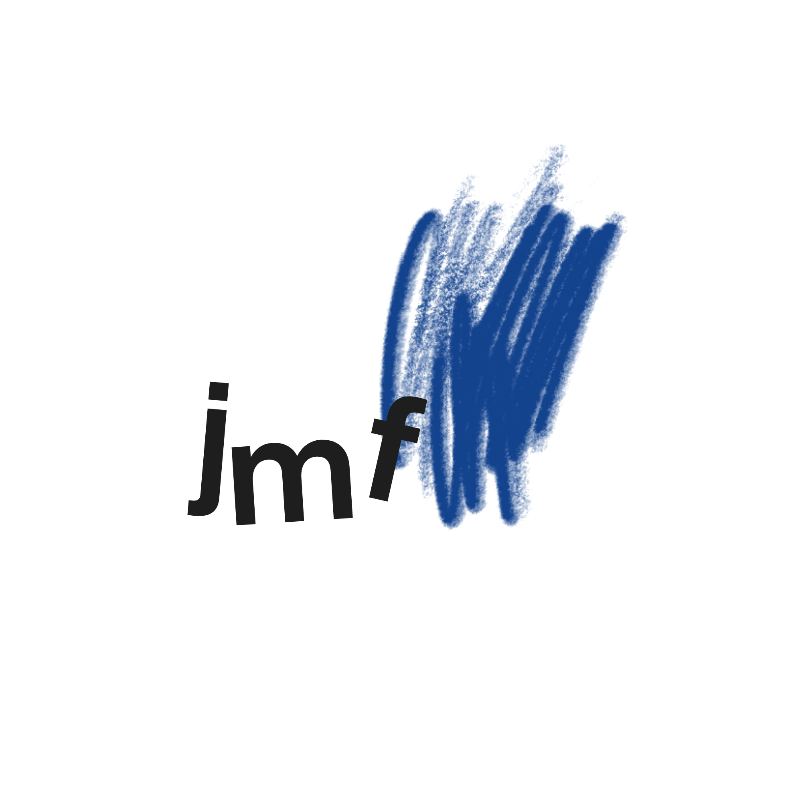

<html lang="de">
<head>
    <meta charset="UTF-8">
    <meta name="viewport" content="width=device-width, initial-scale=1.0">
    <title>M-Fleger | Portfolio & Blog</title>
    
    
</head>
<body class="bg-gray-50 text-gray-900 font-sans antialiased flex flex-col min-h-screen">

    <!-- NAVIGATION -->
    <nav class="bg-white/80 backdrop-blur-md border-b border-gray-100 sticky top-0 z-50 shadow-xs">
        

            <a href="index.html" class="flex items-center gap-4 group no-underline text-current">
                
                M-Fleger
            </a>
            

                <a href="index.html" class="text-blue-600 border-b-2 border-blue-600 pb-1 no-underline">Startseite</a>
                <a href="blog.html" class="hover:text-blue-600 hover:border-b-2 hover:border-blue-600 pb-1 transition-all no-underline">Blog</a>
                <a href="kontakt.html" class="hover:text-blue-600 hover:border-b-2 hover:border-blue-600 pb-1 transition-all no-underline">Kontakt</a>
            

        

    </nav>

    <!-- HERO SEKTION -->
    <header class="bg-gradient-to-br from-blue-800 via-blue-900 to-indigo-950 text-white py-20 px-6 overflow-hidden">
        

            
            

                Design & Development
                <h1 class="text-5xl md:text-6xl font-black tracking-tight mt-5 mb-6 leading-tight">
                    Julian Fleger. Punktgenau verbunden.
                </h1>
                

                    Willkommen auf meiner Website! Hier erfährst du mehr über meine Arbeit, mein Branding und kannst meine neuesten Artikel lesen.
                

                <a href="blog.html" class="bg-cyan-400 text-blue-950 font-black px-8 py-4 rounded-xl shadow-lg hover:bg-cyan-300 transform hover:-translate-y-0.5 transition-all inline-block no-underline">
                    Direkt zum Blog →
                </a>
            

            

                

                    

                    
                

            

        

    </header>

    <!-- INHALT -->
    <main class="max-w-6xl mx-auto px-6 py-20 flex-grow w-full">
        
        <!-- SEKTION 1: NEUESTER BLOGPOST -->
        

            

                

                    <h2 class="text-4xl font-black text-gray-950 tracking-tight">Aktuellster Artikel</h2>
                    
Frisch aus dem Gedankenkarussell gegriffen.

                

                <a href="blog.html" class="text-blue-600 font-bold hover:text-blue-800 transition-colors flex items-center gap-1 group no-underline">
                    Alle Artikel ansehen →
                </a>
            

            
            
            

                

                    {{ latest_post.date | date: "%d.%m.%Y" }}
                    <h3 class="text-3xl font-black text-gray-950 mt-4 mb-3">{{ latest_post.title }}</h3>
                    
{{ latest_post.excerpt | strip_html | truncatewords: 35 }}

                    <a href="{{ latest_post.url | relative_url }}" class="bg-white border border-gray-200 text-gray-900 font-bold px-6 py-3 rounded-xl shadow-xs hover:bg-gray-50 hover:border-gray-300 transition inline-block no-underline">
                        Artikel lesen →
                    </a>
                

            

            
            

                
Bisher wurden noch keine Blog-Artikel veröffentlicht.

            

            
        

        <!-- SEKTION 2: MEINE LOGOS -->
        

            

                <h2 class="text-4xl font-black text-gray-950 tracking-tight">Eigene Brandings</h2>
                
Klarer Fokus. &nbsp;&bull;&nbsp; Punktgenau verbunden.

            

            
            <!-- Dein persönlicher Einleitungstext schön hervorgehoben -->
            

                

                    „Als ich das erstellt habe, war mir echt wichtig, dass sofort klar ist: Hier verbinden sich klare Strukturen mit kreativer Freiheit. Es geht nicht nur um ein Bild, sondern um den Moment, in dem eine eine Idee Gestalt annimmt. Für mich ist das JMF-Scribble der Anfang jeder kreativen Schöpfung und das Blue Vision Auge der Fokus, den man braucht, um etwas Neues in die Welt zu bringen.“
                

            

            

                <!-- JMF Scribble Kachel -->
                

                    

                        

                            
                        

                        <h3 class="text-2xl font-black text-gray-950 mb-3">JMF-Scribble</h3>
                        

                            Das Logo basiert auf meinen Initialen und ist in einem klaren, geometrischen Anthrazit-Grau gehalten. Der lebendige blaue Akzent im Hintergrund, der an eine schnelle Skizze oder einen Pinselstrich erinnert, steht für Kreativität, frische Ideen und die nötige Portion „Scribble“ vor jedem großen Entwurf. Es symbolisiert die Balance zwischen Struktur und kreativer Energie.
                        

                    

                

                <!-- Blue Vision Kachel -->
                

                    

                        

                            
                        

                        <h3 class="text-2xl font-black text-gray-950 mb-3">Blue Vision</h3>
                        

                            Das Logo zeigt ein stilisiertes, waches Auge, das von einem kräftigen, leuchtenden Blau umrandet ist. Der grafische, fast handgezeichnete Stil der Wimpern verleiht ihm eine besondere Note. Es steht für die Fähigkeit, das Wesentliche klar zu erkennen, Visionen zu haben, Achtsamkeit zu zeigen und über den Tellerrand hinauszuschauen. Das Auge symbolisiert Erkenntnis und den unermüdlichen Willen, die eigenen Ziele nicht aus den Augen zu verlieren.
                        

                    

                

            

        

    </main>

    <!-- FOOTER -->
    <footer class="bg-white border-t border-gray-100 py-8 px-6 mt-12 text-center text-gray-500 font-medium">
        

            
&copy; 2026 M-Fleger. Alle Rechte vorbehalten.

            

                <a href="index.html" class="hover:text-blue-600 transition-colors no-underline">Startseite</a>
                <a href="blog.html" class="hover:text-blue-600 transition-colors">Blog</a>
                <a href="kontakt.html" class="hover:text-blue-600 transition-colors">Kontakt</a>
            

        

    </footer>

</body>
</html>
