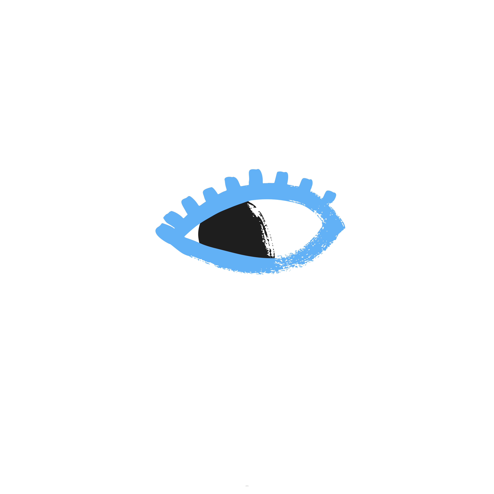

<html lang="de">
<head>
    <meta charset="UTF-8">
    <meta name="viewport" content="width=device-width, initial-scale=1.0">
    <title>Kontakt - M-Fleger</title>
    
</head>
<body class="bg-gray-50 text-gray-900 font-sans antialiased flex flex-col min-h-screen">

    <!-- NAVIGATION -->
    <nav class="bg-white border-b border-gray-100 sticky top-0 z-50 shadow-xs">
        

            <a href="{{ '/' | relative_url }}" class="flex items-center gap-4 group no-underline text-current">
                
                M-Fleger
            </a>
            

                <a href="{{ '/' | relative_url }}" class="hover:text-blue-600 hover:border-b-2 hover:border-blue-600 pb-1 transition-all no-underline">Startseite</a>
                <a href="{{ '/ueber-mich.html' | relative_url }}" class="hover:text-blue-600 hover:border-b-2 hover:border-blue-600 pb-1 transition-all no-underline">Über mich</a>
                <a href="{{ '/blog.html' | relative_url }}" class="hover:text-blue-600 hover:border-b-2 hover:border-blue-600 pb-1 transition-all no-underline">Blog</a>
                <a href="{{ '/kontakt.html' | relative_url }}" class="hover:text-blue-600 hover:border-b-2 hover:border-blue-600 pb-1 transition-all no-underline">Kontakt</a>
            

        

    </nav>

    <header class="bg-gradient-to-br from-blue-800 via-blue-900 to-indigo-950 text-white py-16 px-6 text-center">
        

            <h1 class="text-4xl md:text-5xl font-black tracking-tight mb-4">Lass uns connecten!</h1>
            
Du hast Fragen oder möchtest mich erreichen? Melde dich unkompliziert per E-Mail oder Social Media.

        

    </header>

    <main class="max-w-2xl mx-auto px-6 py-16 flex-grow w-full">
        

            <h2 class="text-3xl font-black text-gray-950 mb-2 text-center md:text-left">Direktkontakt</h2>
            
Hier findest du meine offiziellen Erreichbarkeiten:

            

                

                    
@

                    

                        
E-Mail

                        <a href="mailto:julian@fleger.de" class="text-gray-900 font-extrabold text-xl hover:text-blue-600 transition-colors no-underline">julian@fleger.de</a>
                    

                

                

                    
👻

                    

                        
Snapchat

                        
zfd.julian

                    

                

            

        

    </main>

    <footer class="bg-white border-t border-gray-100 py-8 px-6 text-center text-gray-500 font-medium">
        

            
&copy; 2026 M-Fleger. Alle Rechte vorbehalten.

            

                <a href="index.html" class="hover:text-blue-600 transition-colors no-underline">Startseite</a>
                <a href="blog.html" class="hover:text-blue-600 transition-colors no-underline">Blog</a>
                <a href="kontakt.html" class="hover:text-blue-600 transition-colors no-underline">Kontakt</a>
            

        

    </footer>

</body>
</html>
